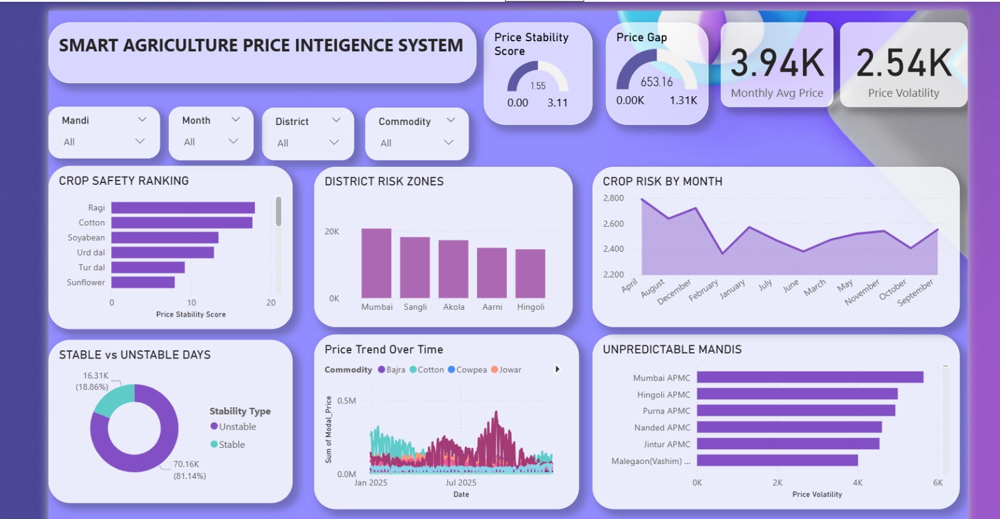
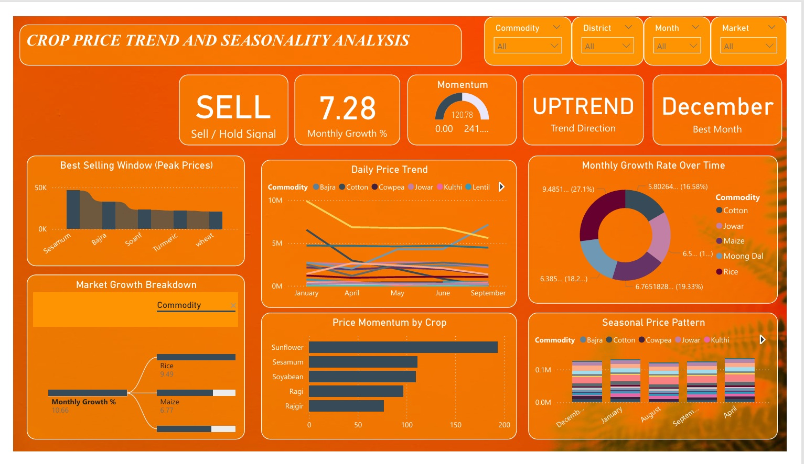
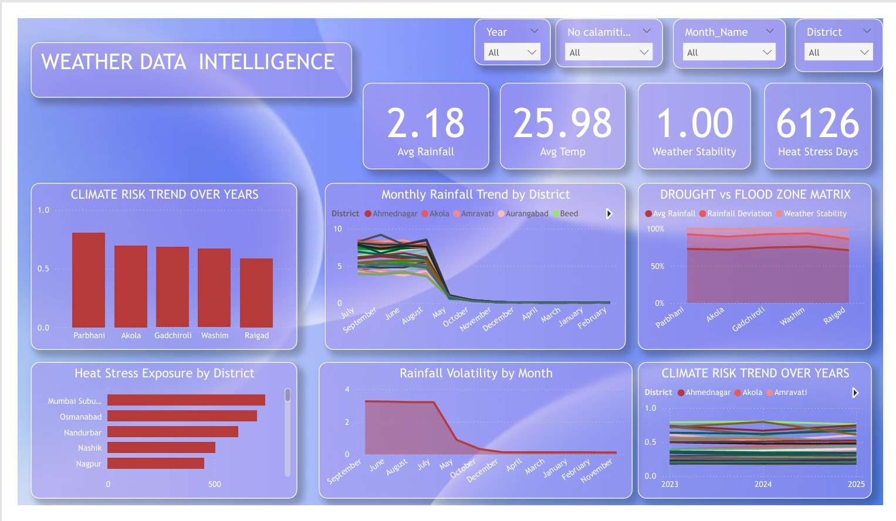
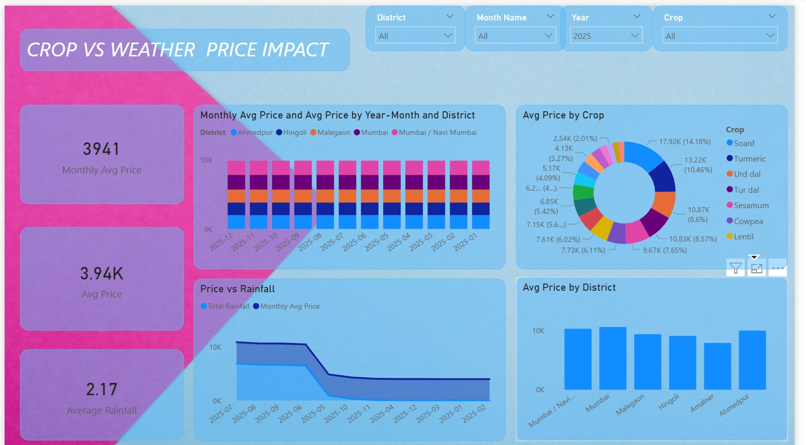

# 🌾 Smart Agriculture Analytics Suite

> An end-to-end Business Intelligence solution built using **Power BI** to analyze agricultural market trends, crop pricing, weather conditions, and climate risks. The project transforms raw agricultural datasets into interactive dashboards that support data-driven decision-making for farmers, policymakers, and agricultural analysts.

---

# 📌 Table of Contents

* Project Overview
* Problem Statement
* Objectives
* Technology Stack
* Dashboard Modules
* Key Features
* Key Insights
* Repository Structure
* How to Run
* Future Improvements
* Author

---

# 📖 Project Overview

Agriculture generates massive amounts of data every day, including crop prices, weather records, rainfall measurements, market arrivals, and district-wise production statistics. However, extracting meaningful insights from such large datasets using traditional spreadsheets is time-consuming and inefficient.

This project addresses these challenges by developing a **Power BI-based analytics suite** consisting of four interactive dashboards. Each dashboard focuses on a different aspect of agricultural intelligence, enabling users to explore trends, compare regions, evaluate climate risks, and identify pricing opportunities through interactive visualizations.

---

# 🎯 Problem Statement

Farmers, traders, and government agencies often struggle to interpret agricultural data due to its size and complexity.

Some common questions include:

* Which crops have the highest price stability?
* Which districts are most vulnerable to climate risks?
* How does rainfall affect crop prices?
* Which months provide the best selling opportunity?
* Which markets experience the highest price volatility?

This dashboard suite provides a centralized analytics platform that answers these questions through interactive visual reports.

---

# 🎯 Objectives

* Analyze historical crop prices.
* Study seasonal price fluctuations.
* Compare rainfall with commodity prices.
* Monitor climate-related agricultural risks.
* Evaluate market price volatility.
* Enable interactive filtering and exploration through Power BI.

---

# 🛠 Technology Stack

### Business Intelligence

* Power BI Desktop

### Data Processing

* Power Query

### Calculations

* DAX (Data Analysis Expressions)

### Data Sources

* Agricultural Market Dataset
* Weather Dataset
* Rainfall Dataset

---

# 📊 Dashboard Modules

## Module 1 – Smart Agriculture Price Intelligence

This dashboard provides an overview of agricultural market stability through various KPIs and risk indicators.

### Features

* Crop Safety Ranking
* Price Stability Score
* Price Gap Analysis
* Stable vs Unstable Days
* District Risk Zones
* Price Trend Analysis
* Market Volatility

### Dashboard Preview



---

## Module 2 – Crop Price Trend & Seasonality

This dashboard analyzes seasonal crop price behavior and identifies the best selling periods.

### Features

* Daily Price Trends
* Monthly Growth Rate
* Seasonal Price Pattern
* Best Selling Window
* Price Momentum
* Market Growth Breakdown

### Dashboard Preview



---

## Module 3 – Weather Data Intelligence

This dashboard focuses on weather analytics and climate-related agricultural risks.

### Features

* Rainfall Trend Analysis
* Heat Stress Monitoring
* Climate Risk Analysis
* Drought vs Flood Matrix
* Rainfall Volatility
* Weather Stability Score

### Dashboard Preview



---

## Module 4 – Crop vs Weather Price Impact

This dashboard analyzes the relationship between rainfall patterns and agricultural market prices.

### Features

* Rainfall vs Crop Price Analysis
* District Comparison
* Crop Comparison
* Monthly Price Trends
* Weather Impact Analysis
* Interactive Filtering

### Dashboard Preview



---

# ⭐ Key Features

* Interactive slicers and filters
* Dynamic DAX-based KPIs
* Multi-dashboard analytics solution
* Climate risk assessment
* Crop price trend monitoring
* Weather intelligence
* Market volatility analysis
* Cross-dashboard insights
* User-friendly visualizations

---

# 📈 Key Insights

* Identified districts with high agricultural risk.
* Compared rainfall patterns with crop price fluctuations.
* Ranked crops based on market stability.
* Identified seasonal selling windows for commodities.
* Highlighted highly volatile agricultural markets.
* Visualized climate trends influencing crop production.

---

# 📁 Repository Structure

```text
Agriculture-Analytics-Suite
│
├── README.md
├── Smart_Agriculture_Price_Intelligence.pbix
├── Crop_Price_Trend_and_Seasonality.pbix
├── Weather_Data_Intelligence.pbix
├── Crop_vs_Weather_Price_Impact.pbix
│
└── assets
    ├── module1.png
    ├── module2.png
    ├── module3.png
    └── module4.png
```

---

# 🚀 How to Run

1. Clone this repository.
2. Open any `.pbix` file using **Power BI Desktop**.
3. Refresh the dataset if prompted.
4. Explore the dashboards using the available filters and slicers.

---

# 🔮 Future Improvements

* Live weather API integration
* Real-time crop price updates
* Machine Learning–based price forecasting
* Farmer recommendation system
* Automated data refresh
* Mobile-optimized dashboard

---

# 👩‍💻 Author

**Tanishka Ajay Badhai**
